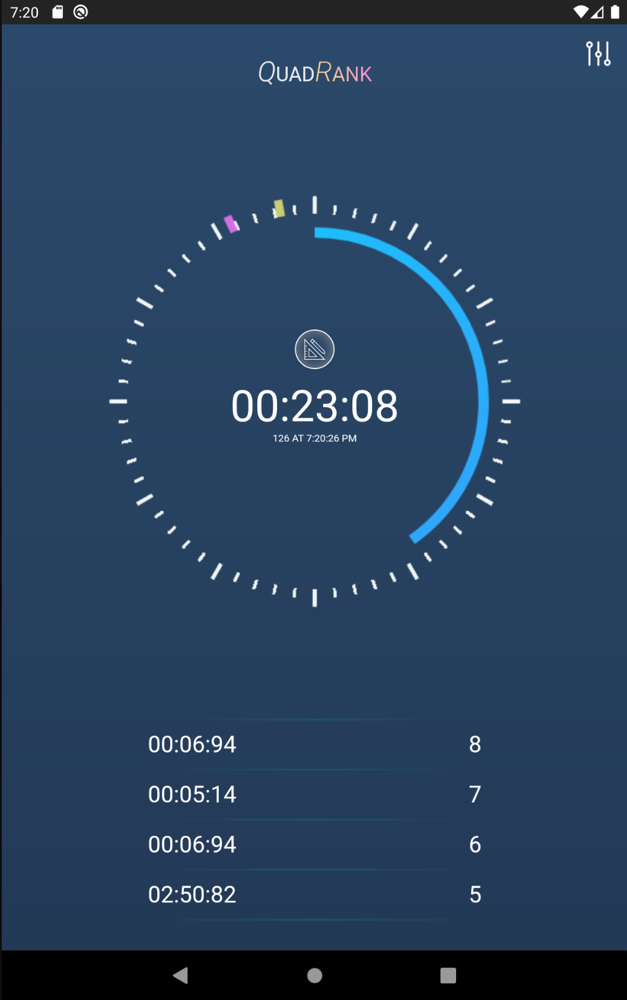

# Overview
This repo hosts all the firmware for the QuadRank timer hardware.
For instructions on how to build the timer. Please refer to [http://qdrk-timer.huu.la](http://qrdk-timer-cn.huu.la).

# Android App
In Review.

# iOS App
To be supported.

# App screenshots
  

*Inspired by Delta 5 Race Timer Project: https://github.com/scottgchin/delta5_race_timer
